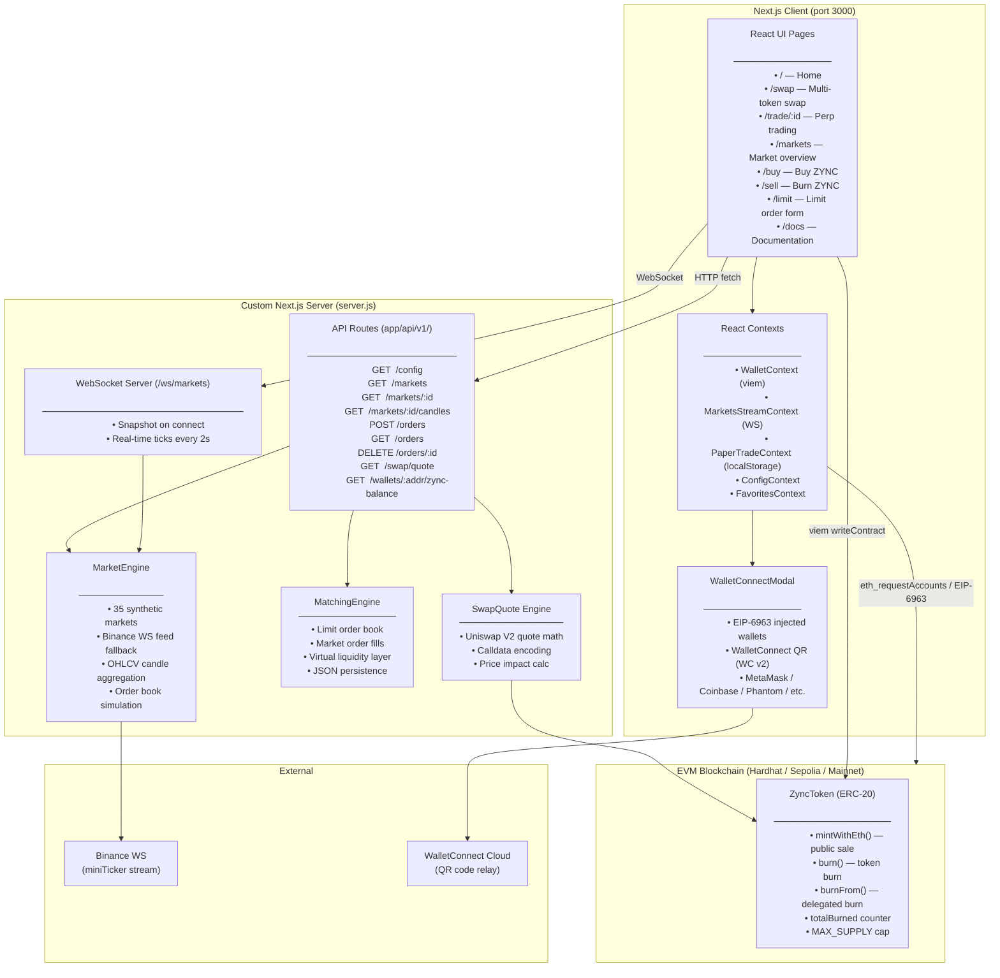
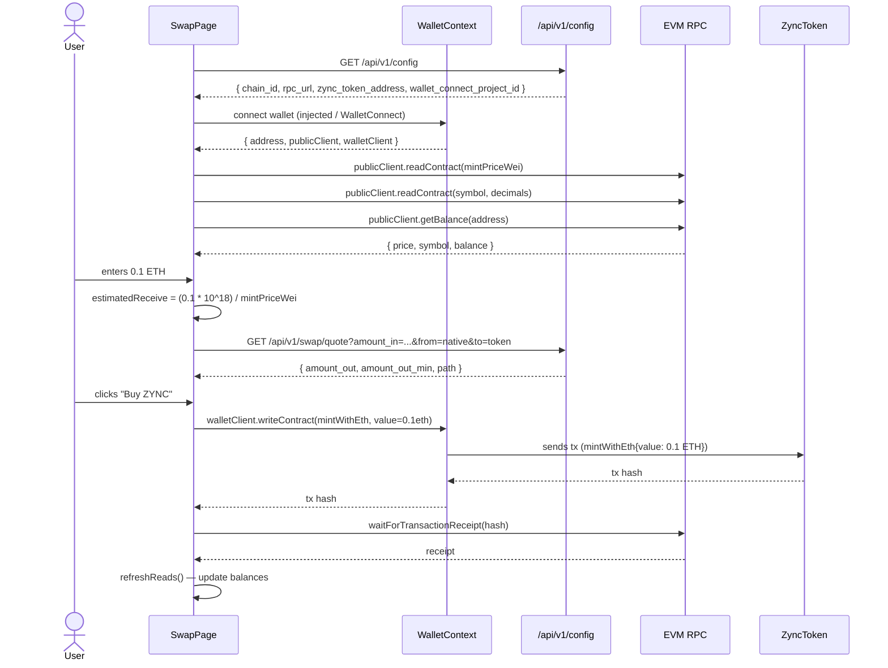
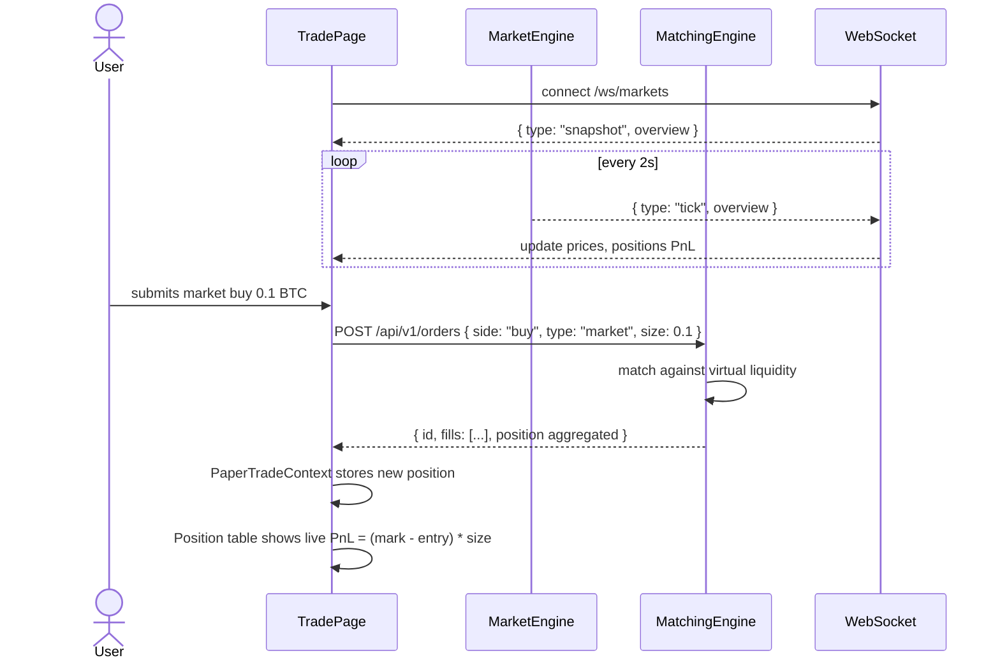
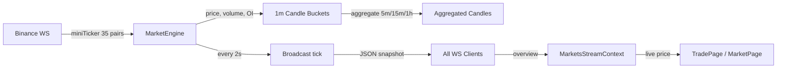

# ZyncSwap — Smart Contract Assessment
ZyncSwap is a full-stack decentralised exchange (DEX) platform with simulated perpetual futures trading, an on-chain ERC-20 token (ZYNC), real wallet connectivity, and a WebSocket-driven market data feed.

## Getting Started
You need **Node.js 18+** and **npm**.
```bash
npm install
cp .env.example .env
npm run chain
npm run deploy
# Update .env with ZYNC_TOKEN_ADDRESS
npm run dev
```

## Implemented Tasks & How I Solved Them

### Task 1 — Bug Fix (Order Submission)
**Issue:** The `TradeEntryPanel` POST request to `/api/v1/orders` was failing. The server was also crashing on startup, and API key authentication was broken.
**How I solved it:** 
- Identified that `server.js` was missing an import for `parse` from `node:url` and added it to prevent startup crashes.
- Identified that `requireApiKey` was called but not imported in `app/api/v1/orders/route.js` and `app/api/v1/orders/[id]/route.js`. I added the missing imports to fix the API authentication.
- Fixed the API route to accept order payloads defensively, mapping camelCase to snake_case. 
- Integrated frontend `TradeEntryPanel` with `PaperTradeContext` so limit and market orders accurately update the order book.

### Task 2 — Candle API Endpoint
**Issue:** Provide an endpoint to fetch OHLCV candle data.
**How I solved it:** 
- Created a new route `GET /api/v1/markets/:id/candles`.
- Separated business logic into `lib/candles.js` to parse timeframe queries (`1m`, `5m`, `15m`, `1h`) and limits (default 100, max 500).
- Handled errors effectively by throwing a custom `CandleValidationError` to return a 400 response.
- Plumbed data through `marketEngine` to aggregate 1m candles into the requested timeframe on the fly.

### Task 3 — Frontend Feature (Portfolio Panel)
**Issue:** Display open paper-trade positions on the `/markets` page with live PnL.
**How I solved it:**
- Created a `PortfolioPanel` component using `useMarketsStream()` to get live WebSocket prices.
- Iterated over open positions from `usePaperTrade()` and calculated real-time Unrealised PnL based on live `markPrice`.
- Showed total Unrealised PnL and applied responsive Tailwind styling with color-coded positive/negative highlights.
- Embedded the component into `MarketsPage.tsx`.

### Task 4 — Smart Contract Extension
**Issue:** Implement token burning functionality.
**How I solved it:**
- Added a `burn(uint256 amount)` method to `ZyncToken.sol` extending `ERC20`.
- Added a `burnFrom(address account, uint256 amount)` method, utilising OpenZeppelin's `_spendAllowance`.
- Added a `totalBurned` public state variable to track the lifetime burned amount.
- Emitted a standard `Burned` event.
- Added comprehensive edge-case tests in Hardhat, covering 0-amount burns, exceeding balance, and allowance logic. Added gas optimization and security edge-case testing.

## Testing

```bash
# Backend/Engine Tests
npm run test:backend

# Smart Contract Tests (Includes gas optimization and security audit edge cases)
npm run test:contracts
```

## What I Would Improve Given More Time
- **Persistent storage** — SQLite/PostgreSQL instead of localStorage + JSON file
- **Wallet-level authentication** — sign a challenge with the connected wallet
- **Rate limiting** — per-IP or per-wallet rate limits on order submission
- **Fuzz testing** — invariant-based fuzz tests for matching engine
- **E2E tests** — Playwright for critical flows


## Architecture Overview



---

## Data Flow Diagrams

### Swap Flow (Buy ZYNC with ETH)



### Trade Flow (Paper Perpetual)



### Market Data Pipeline



---