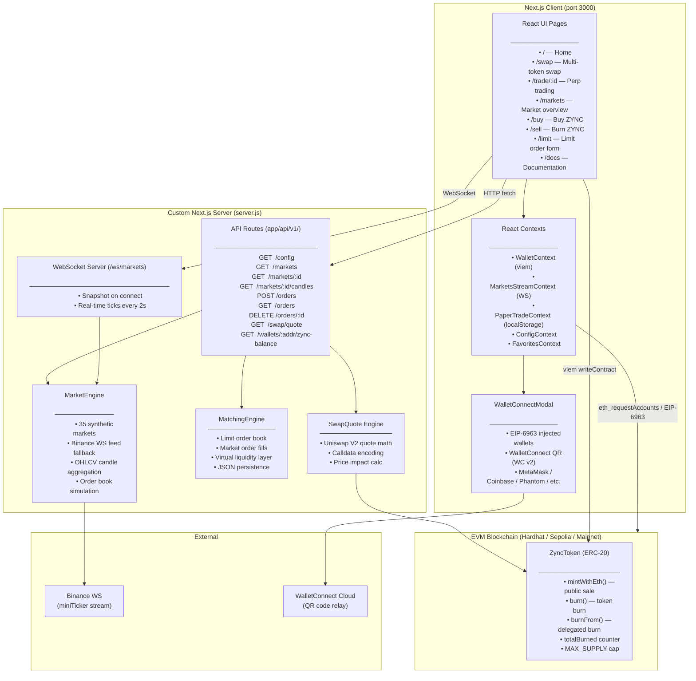
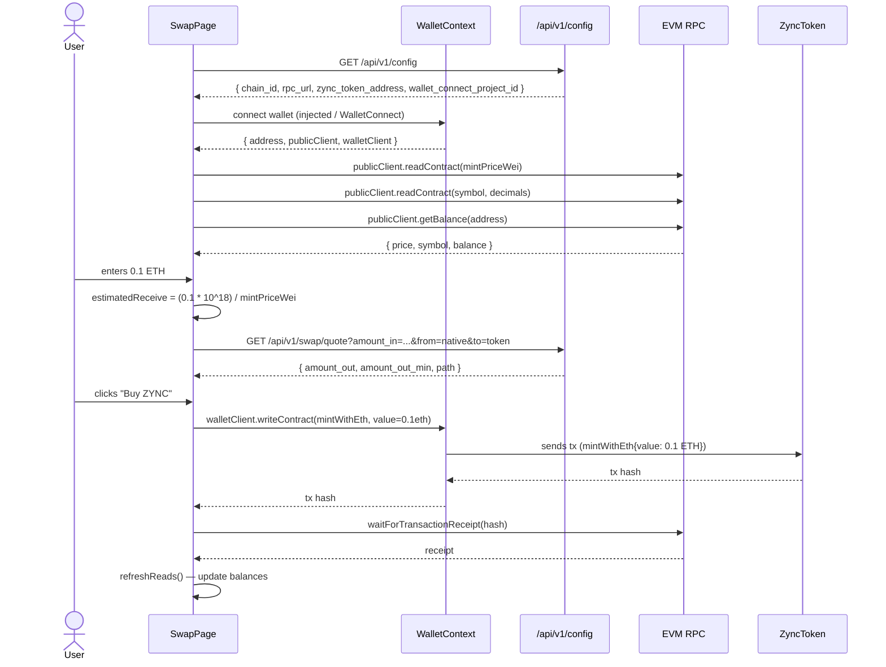
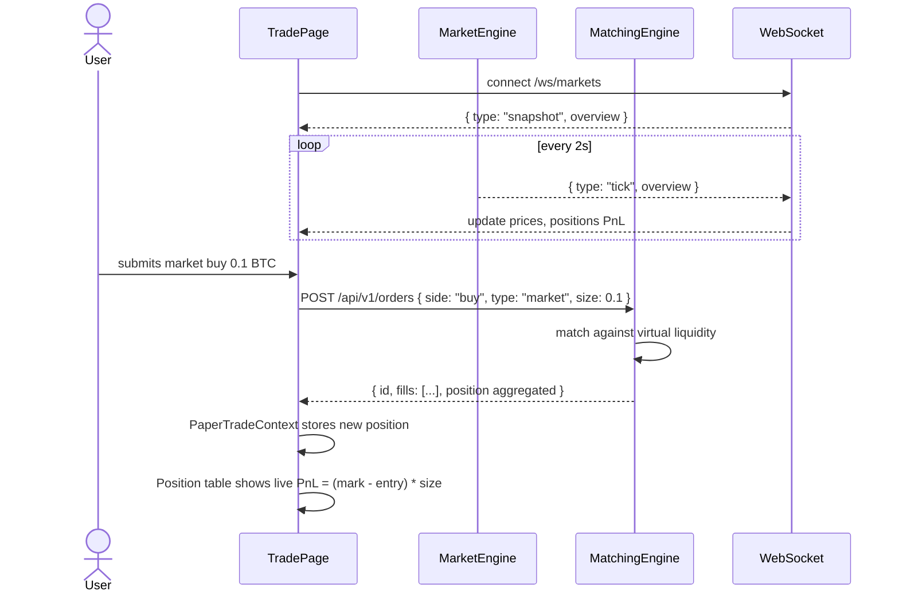
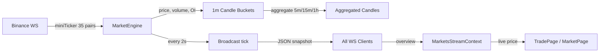

# ZyncSwap — Smart Contract Assessment

ZyncSwap is a full-stack decentralised exchange (DEX) platform with simulated perpetual futures trading, an on-chain ERC-20 token (ZYNC), real wallet connectivity, and a WebSocket-driven market data feed. It is designed as a technical assessment submission demonstrating production-grade Solidity, TypeScript, React, and systems integration.

---

## Architecture Overview



---

## Data Flow Diagrams

### Swap Flow (Buy ZYNC with ETH)



### Trade Flow (Paper Perpetual)



### Market Data Pipeline



---

## Getting Started

You need **Node.js 18+** and **npm**.

```bash
# 1. Clone the repo
git clone <your-fork-url>
cd smart-contract-assessment
npm install

# 2. Set up environment variables
cp .env.example .env
#  Edit .env to match your setup (see Env Vars section)

# 3. Start a local Hardhat blockchain (keep this terminal open)
npm run chain

# 4. Deploy the ZyncToken contract (new terminal)
npm run deploy
# Copy the printed address into .env as ZYNC_TOKEN_ADDRESS

# 5. Start the app (frontend + backend + WebSocket)
npm run dev
# → http://localhost:3000
```

### How to Run Everything

| What | Command | Notes |
|------|---------|-------|
| **Frontend + Backend** | `npm run dev` | Starts custom Next.js server on port 3000 with WebSocket and matching engine. Open http://localhost:3000 |
| **Blockchain node** | `npm run chain` | Starts Hardhat local node on port 8545. Keep this running in a separate terminal. |
| **Deploy contract** | `npm run deploy` | Deploys ZyncToken to localhost. Copy the printed address into `ZYNC_TOKEN_ADDRESS` in `.env`. |
| **Contract tests** | `npm run test:contracts` | 8 Hardhat tests (mint, burn, burnFrom edge cases). Does NOT need `npm run chain`. |
| **Backend tests** | `npm run test:backend` | 11 matching engine tests (limit/market orders, cancellation, validation). |
| **Run all tests** | `npm test` | Runs both contract and backend tests in sequence. |

> **Note:** `npm run dev` starts everything — the frontend, API routes, WebSocket market feed, matching engine, and the simulated order books. There is no separate "start backend" command because it's all one process.


The app supports two wallet connection methods:

| Method | What you need | Works on |
|--------|--------------|----------|
| **Injected (EIP-6963)** | MetaMask / Coinbase / Phantom / etc. browser extension | Desktop only |
| **WalletConnect (QR)** | `NEXT_PUBLIC_WALLETCONNECT_PROJECT_ID` in `.env` | Desktop + Mobile |

To enable WalletConnect:
1. Go to https://cloud.walletconnect.com and create a free account
2. Create a new project → copy the **Project ID**
3. Add it to `.env`: `NEXT_PUBLIC_WALLETCONNECT_PROJECT_ID=your_id_here`
4. A demo project ID is provided in `.env.example` — replace for production

For the Hardhat local chain, connect your wallet to `http://127.0.0.1:8545` (chain ID 31337) and import the Hardhat test accounts (private keys printed by `npm run chain`).

---

## Project Structure

```
├── client/                          # Next.js app + custom server
│   ├── app/
│   │   ├── (dex)/                   # Route group — wrapped by Providers + AppShell
│   │   │   ├── page.tsx             # Home page
│   │   │   ├── swap/page.tsx        # Multi-token swap
│   │   │   ├── trade/[id]/page.tsx  # Perpetual trading
│   │   │   ├── markets/page.tsx     # Markets overview
│   │   │   ├── buy/page.tsx         # Quick-buy ZYNC
│   │   │   ├── sell/page.tsx        # Quick-sell / burn ZYNC
│   │   │   ├── limit/page.tsx       # Limit order form
│   │   │   ├── docs/page.tsx        # In-app docs
│   │   │   └── layout.tsx           # Providers + AppShell wrapper
│   │   ├── api/
│   │   │   └── v1/
│   │   │       ├── config/route.js
│   │   │       ├── markets/route.js + [id]/route.js + [id]/candles/route.js
│   │   │       ├── orders/route.js + [id]/route.js
│   │   │       ├── swap/quote/route.js
│   │   │       └── wallets/[address]/zync-balance/route.js
│   │   ├── layout.tsx              # Root layout (next/font + metadata)
│   │   ├── global-error.tsx        # Root error boundary
│   │   └── providers.tsx           # Client-side providers wrapper
│   ├── lib/
│   │   ├── marketEngine.js         # 35-market simulator + Binance WS
│   │   ├── matchingEngine.js       # Limit order book + matching
│   │   ├── candles.js              # Candle query parsing
│   │   ├── swapQuote.js            # Uniswap V2 quote math
│   │   ├── config.js               # Env var helpers
│   │   └── engines.js              # globalThis accessors
│   ├── src/
│   │   ├── views/                  # Page-level components
│   │   │   ├── SwapPage.tsx        # Multi-token swap
│   │   │   ├── TradePage.tsx       # Perp trading
│   │   │   ├── MarketsPage.tsx     # Market overview + portfolio
│   │   │   ├── MintPanel.tsx       # Standalone ZYNC mint
│   │   │   ├── BuyPage.tsx         # Quick-buy (functional)
│   │   │   ├── SellPage.tsx        # Quick-sell (functional)
│   │   │   ├── LimitPage.tsx       # Limit order UI
│   │   │   ├── HomePage.tsx        # / route
│   │   │   └── DocsPage.tsx        # /docs route
│   │   ├── components/
│   │   │   ├── dex/                # Perp trading components
│   │   │   │   ├── TradingChart.tsx    # TradingView widget
│   │   │   │   ├── TradeEntryPanel.tsx # Order entry (market + limit)
│   │   │   │   ├── PortfolioPanel.tsx  # Portfolio positions
│   │   │   │   ├── PairSelector.tsx
│   │   │   │   ├── FavoritesBar.tsx
│   │   │   │   ├── AppShell.tsx
│   │   │   │   └── SparklineSvg.tsx
│   │   │   ├── SwapPanel.tsx       # Swap UI primitives
│   │   │   ├── WalletConnectModal.tsx # Wallet connection modal
│   │   │   ├── WalletBar.tsx       # Wallet status bar
│   │   │   ├── MintPanel.tsx       # ZYNC mint panel
│   │   │   └── ErrorBoundary.tsx   # React error boundary
│   │   ├── context/
│   │   │   ├── PaperTradeContext.tsx # Paper trading state
│   │   │   ├── MarketsStreamContext.tsx # WS market feed
│   │   │   ├── ConfigContext.tsx
│   │   │   └── FavoritesContext.tsx
│   │   ├── wallet/
│   │   │   ├── WalletContext.tsx    # viem wallet + EIP-6963 + WC
│   │   │   ├── walletCatalog.ts    # 8-wallet catalog + detection
│   │   │   └── walletBrandIcons.tsx
│   │   ├── abi/zync.ts             # ZyncToken ABI
│   │   └── types.ts / types/markets.ts
│   ├── public/wallets/             # Wallet brand icons (8 images)
│   ├── server.js                   # Custom Next.js server + WebSocket
│   ├── next.config.mjs             # Headers, webpack config
│   └── package.json
├── contracts/
│   ├── contracts/ZyncToken.sol     # ERC-20 with mint/burn/totalBurned
│   ├── test/ZyncToken.test.cjs     # 8 Hardhat tests
│   └── scripts/deploy.cjs          # Hardhat deploy script
├── tests/
│   └── matchingEngine.test.js      # 11 matching engine tests
├── .env.example
├── package.json                    # Workspace root
└── readme.md
```

---

## Scripts

| Command | Description |
|---------|-------------|
| `npm run chain` | Start local Hardhat node (31337) |
| `npm run deploy` | Deploy ZyncToken to localhost |
| `npm run compile` | Compile Solidity contracts |
| `npm run test:contracts` | Run 8 Hardhat contract tests |
| `npm run test:backend` | Run 11 matching engine tests |
| `npm test` | Run ALL tests (contracts + backend) |
| `npm run dev` | Start Next.js dev server on port 3000 (frontend + backend + WS) |
| `npm run client:build` | Production build (see known issues below) |
| `npm run start` | Start production server |

---

## API Reference

### Config

```
GET /api/v1/config
```

Returns `{ company, app_name, chain_id, rpc_url, zync_token_address, aurelexa_tagline, wallet_connect_project_id }`.

### Markets

```
GET /api/v1/markets              → MarketsOverview
GET /api/v1/markets/:id          → MarketDetail (book + trades + candles)
GET /api/v1/markets/:id/candles?timeframe=5m&limit=100  → Candle[]
```

Timeframes: `1m`, `5m`, `15m`, `1h`. Returns 400 on invalid params.

### WebSocket

```
ws://localhost:3000/ws/markets
```

Messages:
- `{ type: "snapshot", overview }` — full state on connect
- `{ type: "tick", overview }` — every 2s with current prices

### Orders (Paper Trading)

```
POST /api/v1/orders   { marketId, side, type, size, limitPrice? }  🔐
GET  /api/v1/orders
DELETE /api/v1/orders/:id                                          🔐
```

🔐 = Requires `x-api-key` header if `API_KEY` is set in `.env`.

### Swap

```
GET /api/v1/swap/quote?amount_in=<wei>&from=native|<token>&to=native|<token>
```

Returns `{ amount_out, amount_out_min, swap_kind, path, path_note }`.

### Wallets

```
GET /api/v1/wallets/:address/zync-balance
```


| Method | Standard | UX | 
|--------|----------|----|
| **MetaMask** | `window.ethereum` / `isMetaMask` | One-click if extension installed |
| **Coinbase Wallet** | `window.ethereum` / `isCoinbaseWallet` | One-click if extension installed |
| **Trust Wallet** | `window.ethereum` / `isTrust` | One-click if extension installed |
| **Rainbow** | `window.ethereum` / `isRainbow` | One-click if extension installed |
| **Phantom (EVM)** | `window.phantom.ethereum` | One-click if extension installed |
| **Exodus** | `window.exodus.ethereum` | One-click if extension installed |
| **Binance Wallet** | `window.ethereum` / `isBinance` | One-click if extension installed |
| **SafePal** | `window.ethereum` / `isSafePal` | One-click if extension installed |
| **WalletConnect** | EIP-1193 via `@walletconnect/ethereum-provider` | QR code (mobile) |


### Connection Flow

1. User clicks "Connect wallet" → `WalletConnectModal` opens
2. Modal shows:
   - **Detected wallets** (EIP-6963 announced providers)
   - **WalletConnect** QR code button
   - **Popular wallets** catalog (all 8 above)
3. User picks a method → provider detected → `eth_requestAccounts` called
4. Provider stored in `WalletContext` → viem `walletClient` created via `custom()` transport
5. Account/chain listeners attached (`accountsChanged`, `chainChanged`, `disconnect`)
6. All transaction calls go through `walletClient.writeContract()`

---

## Implemented Tasks

### Task 1 — Bug Fix (Order Submission)

Orders submit correctly: frontend → `POST /api/v1/orders` → matching engine. Both `limit` and `market` orders work with virtual liquidity from the simulated book.

Additional fixes:
- Position aggregation by market+side with weighted-average entry price
- `closePosition` calculates and stores realised PnL
- Raw `throw e` in orders route → structured 500 error response

### Task 2 — Candle API

`GET /api/v1/markets/:id/candles` supports `1m`, `5m`, `15m`, `1h` with strict validation. Data aggregated from 1m source candles stored in the market engine.

### Task 3 — Portfolio Panel + Paper Trade History

- Portfolio panel on `/markets` shows open paper positions with live PnL, PnL %, total unrealised PnL
- Trade page bottom tabs: positions (with PnL %), open orders, closed trades (realised PnL)
- Loading skeletons, error boundaries

### Task 4 — Smart Contract Extension

`ZyncToken.sol`:
- `burn(uint256)` — holder burns own tokens, emits `Burned`, increments `totalBurned`
- `burnFrom(address, uint256)` — burns via ERC-20 allowance
- `totalBurned` public counter
- 8 Hardhat tests cover all edge cases

---

## Testing

```bash
# Matching engine (11 tests)
npm run test:backend

# Contract tests (8 tests)
npm run test:contracts
```

### Test Coverage

**MatchingEngine** (node:test/mocha):
- Market buy/sell fills against virtual liquidity
- Limit order stays open / crosses spread and fills
- Order cancellation (open + filled)
- Invalid side/type/price/size rejection

**ZyncToken** (Hardhat):
- mints ZYNC for ETH at public price
- burn — caller tokens, zero amount, exceeds balance
- burnFrom — approved account, no allowance, insufficient allowance, exceeds balance

---

## Known Issues & Build Notes

### `npm run client:build` (`next build`)

The standalone `next build` command may time out or fail in some environments. This is because:

1. `client/lib/engines.js` now lazy-creates engine singletons on first access, so the **old throw-on-missing error is fixed**.
2. However, `next build` also runs static analysis on page files, which can trigger dependency resolution of server-only modules. The build relies on `config.resolve.fallback` (fs, net, tls) in `next.config.mjs`.
3. If the build does time out, it's typically a Webpack resolution issue, not an engine init issue.

**Workaround**: Always run via `npm run dev` (development) or `npm run start` (production). These both use `node server.js` which properly initialises all engines. The build issue does not affect runtime.

### Other Notes

- **WalletConnect**: The `.env.example` includes a demo project ID. Replace it with your own from [WalletConnect Cloud](https://cloud.walletconnect.com) for production use.
- **API Auth**: Set `API_KEY` in `.env` to protect write endpoints. Requests must include `x-api-key` header. Leave empty to disable (local dev only).
- **Paper Trades**: Stored in `localStorage`. In incognito/private mode, persistence is silently skipped — trades work for the session but are lost on refresh.

---

## Design Decisions

| Decision | Rationale |
|----------|-----------|
| Custom server + `globalThis` singletons | Avoids Binance WS connections during compilation; engines persist across hot reloads |
| API routes as Next.js route handlers (`.js` ESM) | Leverages Next.js file-system routing while keeping server-side code private |
| viem instead of ethers.js | Tree-shakeable, TypeScript-first, modern ESM |
| EIP-6963 + injected detection + WalletConnect | Supports all major wallets without depending on Wagmi/RainbowKit |
| Paper trades in localStorage | Zero-setup persistence; no backend DB needed |
| Matching engine with virtual liquidity | Enables instant fills without counterparty orders |
| 1m → 5m/15m/1h candle aggregation | Single source of truth; no duplicate storage |
| next/font instead of CDN | Zero external requests; better Lighthouse score |

---

## What I Would Improve Given More Time

- **Persistent storage** — SQLite/PostgreSQL instead of localStorage + JSON file
- **Wallet-level authentication** — sign a challenge with the connected wallet for API routes instead of a shared `API_KEY` secret
- **Order history API** — paginated `GET /api/v1/orders/history`
- **Rate limiting** — per-IP or per-wallet rate limits on order submission
- **Equity curve chart** — PnL over time in portfolio panel
- **Fuzz testing** — invariant-based fuzz tests for matching engine
- **E2E tests** — Playwright for critical flows (place order → position → close)
- **Virtualised lists** — order book and trade list for high-throughput markets
- **Accessibility audit** — ARIA labels, keyboard nav, focus management
- **Standalone `next build`** — the lazy engine init fix works for runtime; a true standalone build would need engine mock stubs during the compilation phase

---

## License

MIT — see [LICENSE](./LICENSE) for details.
